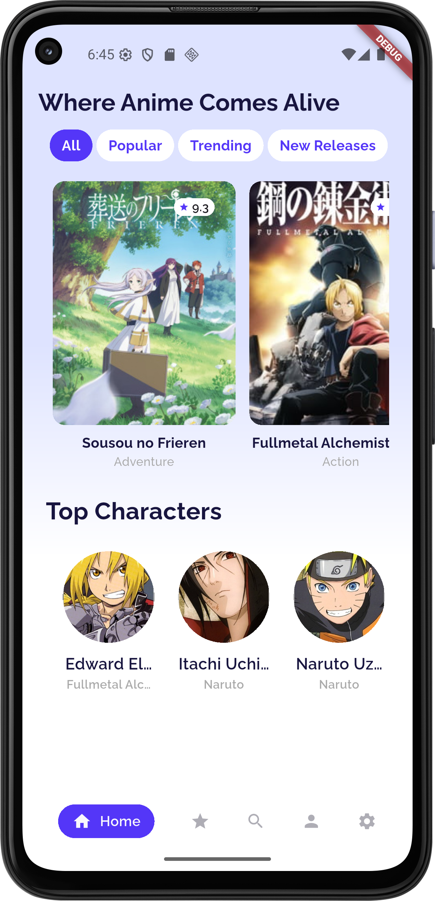

# 🎬 Anime Player App

The **Anime Player App** is a Flutter-based mobile application designed to provide anime lovers with a sleek and interactive experience. It combines an elegant UI with categorized browsing, character highlights, and anime details — creating a space *“Where Anime Comes Alive”*.

---

## ✨ Features

* **Beautiful UI & Theming**

  * Gradient backgrounds, custom colors, and Google Fonts for a stylish look.
  * Consistent theme managed via `MyColor`.

* **Home Screen**

  * AppBar with branding slogan.
  * `TapsBar` for navigation between anime categories.
  * `Posters` widget to showcase featured anime.
  * `Top Characters` section highlighting popular characters.
  * Custom bottom navigation bar (`FancyBottomNav`).
    


* **Anime Details Screen**

  * Anime cover image with smooth layout.
  * Circular title bubble overlay.
  * Genres displayed dynamically with `Wrap` for responsiveness.
  * Metadata section (views, claps, episodes).
  * Synopsis displayed below dividers.
    


* **Purchase Plan Screen**
  
  * Upgrade Plan interface with clean, visually appealing cards.
  * Shows available plans with pricing, family sharing, and selection icons.
  * Continue button for proceeding with subscription or payment.
  * Includes a prominent illustration and gradient background for user engagement.


  
* **Jikan API Integration**

  * Fetches real-time anime data including titles, posters, genres, episodes, and descriptions.
  * Keeps the app always updated with the latest anime content from [MyAnimeList](https://myanimelist.net/).

* **Custom Widgets**

  * **Navigation Bar** – Modern bottom nav with animation.
  * **Posters** – Grid/scrolling display of anime posters.
  * **TapsBar** – Quick filter navigation.
  * **TopCharacters** – Showcase fan-favorite characters.

* **Typography & Scaling**

  * Uses `GoogleFonts` for aesthetic anime-inspired typography.
  * `AutoSizeText` ensures titles scale dynamically to fit bubbles and containers.

---

## 🛠 Tech Stack

* **Framework:** [Flutter](https://flutter.dev/)
* **Language:** Dart
* **API:** [Jikan API](https://jikan.moe/) (MyAnimeList unofficial API)
* **UI Libraries:**

  * [Google Fonts](https://pub.dev/packages/google_fonts)
  * [AutoSizeText](https://pub.dev/packages/auto_size_text)
* **Architecture:** Stateful & Stateless widgets with modular structure.

---

## 📂 Project Structure

```plaintext
lib/
├─ core/
│  └─ colors.dart              # Centralized theme/colors
├─ data/
│  └─ models/
│     └─ anime_model.dart      # Anime data model
├─ presentation/
│  └─ widgets/
│     ├─ navigation_bar.dart   # Bottom navigation
│     ├─ posters.dart          # Posters grid/list
│     ├─ taps.dart             # Top tab navigation
│     ├─ top_characters.dart   # Characters showcase
├─ screens/
│  ├─ home_screen.dart         # Home landing page
│  └─ anime_info.dart          # Anime detail screen
```

---

## 🖼 Screens Overview

* **Home Screen**

  * Gradient background
  * Tab filters (`TapsBar`)
  * Featured posters
  * Top Characters showcase

* **Anime Info Screen**

  * Full cover image background
  * Floating circular title bubble
  * Genres wrapped neatly
  * Stats row: views, claps, episodes
  * Synopsis section

---

## 🚀 Getting Started

1. **Clone the repository**

   ```bash
   git clone https://github.com/yourusername/anime_player.git
   cd anime_player
   ```

2. **Install dependencies**

   ```bash
   flutter pub get
   ```

3. **Run the app**

   ```bash
   flutter run
   ```

---

## 🔮 Future Enhancements

* Add search functionality.
* Implement video playback for anime trailers.
* Dark mode support.
* Add user accounts, favorites, and watchlists.

---

## ❤️ Acknowledgments

This project was built step by step as part of a **learning and exploration journey in Flutter UI development**. Special thanks to [Jikan API](https://jikan.moe/) for powering the app with real anime data And for the people behind **Flutter Mentors 3**.
